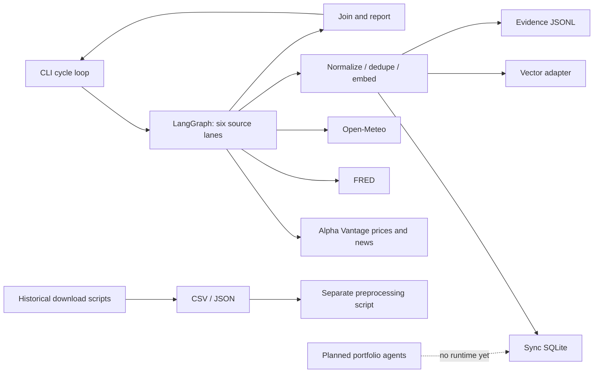

# Phase 1 audit (2026-10-03, before implementation)

Baseline: local `09ca7e3`, plus the six offline data scripts in `origin/main`
`23b5300`. The user confirmed Lynessa07/stop_loss and CandiedOutlaw763/stop_loss
refer to the same project; work continues in the existing checkout. Line numbers
below refer to this baseline, not the subsequently refactored files.

## Repository map

* Entry points: `fin_terminal.ingest` (`--once`, `--stream`, `--live`, `--smoke`),
  the legacy `stop_loss.__main__` CLI, Make targets, and root historical download scripts.
* Active orchestration: `fin_terminal/ingestion/graph.py`, a typed LangGraph
  StateGraph with six parallel fetch/process lanes and a final join. Reducers
  merge per-source status/raw maps, concatenate documents, and sum counts.
  SQLite checkpoints store serializable state. The outer CLI loop waits for the
  whole graph before polling any source again.
* Agents/supervisor/tools: `stop_loss/agents/README.md` describes eight future
  agents. There are no implemented LLM agents, supervisor, system prompts, or
  LLM calls. Do not claim an existing multi-agent engine has been audited or built.
* Integrations: async Alpha Vantage quotes/news, FRED observations, Open-Meteo
  current weather; Weaviate/Pinecone adapters; local/OpenAI embedding wrappers.
  The legacy `stop_loss/ingestion/providers` are unimplemented sync interfaces.
* Historical data: Yahoo/NSE market and macro CSVs, fundamentals JSON, corporate
  actions CSVs, USGS/NOAA disasters, and India/stock headline CSVs in download and
  preprocessing scripts. Treat news as the monitoring agent's media feeds.
  Images/audio/video require metadata ingestion, not invented transcription.
* Config: Pydantic environment settings, `.env.example`; real local credentials
  are ignored. Dependencies use uv/Hatch, httpx, tenacity, Pydantic, LangGraph,
  SQLite checkpointers and LangSmith; embedding packages are optional.
* Persistence/telemetry: SQLite canonical documents, JSONL evidence, vector
  projections, LangSmith roots/node spans. Tests cover fixtures, graph execution,
  failures, dedupe, concurrency, schemas, resilience, adapters, and CLI.

## Findings and fixes

| ID | Severity | Baseline location | Finding / proposed fix |
|---|---|---|---|
| A01 | high | `backend/src/fin_terminal/ingest.py:42-73` | A stalled lane blocks the next fast-source polling cycle. Run independent source producers and bounded processing queues, each with its own LangGraph invocation. |
| A02 | high | `backend/src/fin_terminal/ingestion/graph.py:294,336,431,486`; `storage.py:13-40` | Sync SQLite reads/commits block the event loop; each lane can create its own full worker pool. Move database operations to dedicated serialized executors and bound fast/slow processing separately. |
| A03 | high | `backend/src/fin_terminal/connectors/factory.py:29-95` | Missing live credentials silently substitute successful empty stubs. Return explicitly unavailable connectors instead. |
| A04 | high | `backend/src/fin_terminal/connectors/alphavantage.py:63-88`; `resilience.py:119-160` | Guards wrap entire batches, not individual requests, and news/price streams have separate quota buckets despite sharing a provider. Use shared provider request limits, per-connector semaphores, hard request deadlines and typed errors. |
| A05 | medium | `backend/src/fin_terminal/connectors/base.py:8-23`; live connectors' `_get_client`/`fetch` | No common lifecycle/stream API; HTTP clients are recreated every fetch and health returns unconditional success. Add lifecycle-compatible methods, pooled clients and observed health. |
| A06 | high | `backend/src/fin_terminal/connectors/alphavantage.py:79-88,143`; `fred.py:82,109`; `openmeteo.py:82-111` | Provider error payloads can appear successful; USD and unknown units are asserted without evidence; malformed timestamps/numbers can reject whole batches. Preserve nulls, validate provider envelopes and isolate individual records. |
| A07 | high | `backend/src/fin_terminal/ingestion/graph.py:255-284`; `schemas.py:40-86` | One bad normalized record discards a batch; unsourced documents can still reach indexing. Add per-record rejection, durable dead letters and a strict provenance gate for agent tools. |
| A08 | high | `scripts/preprocess_data.py:27-29` (`origin/main`) | Forward-filling OHLCV fabricates observations, violating AGENTS.md. Preserve missing values with explicit quality flags and source/row lineage. |
| A09 | high | `download_fundamentals.py:25,29` (`origin/main`) | Missing market cap/employees become zero. Preserve nulls and mark quality; include fetch/source references. |
| A10 | medium | `download_calamities.py:40-53` (`origin/main`) and other root downloaders | NOAA request lacks timeout and materializes a large response; requests/yfinance/file operations are synchronous and not behind connector lifecycle. Keep imports inert; route acquisition through async connectors, bounded file readers, and isolated thread adapters for unavoidable sync SDKs. |
| A11 | medium | `backend/src/fin_terminal/observability.py:71,91`; `ingest.py:56-63` | Live traces/reports claim mode=stub; no agent/stream tags, monitoring freshness, 3-hour refresh, or token/cost instrumentation boundary. Add accurate metadata and monitoring graph; unknown usage/cost stays null. |
| A12 | medium | `backend/src/fin_terminal/ingestion/graph.py:238-375`; `embeddings.py:42-49` | One source batch shares its deadline; cold model loading uses the shared default thread pool; no backpressure, stale cache or dead letters. Use bounded microbatches, isolated executors and non-blocking last-good snapshots. Keep measured SLA breaches visible. |
| A13 | medium | `README.md:40-65`; `backend/pyproject.toml:12-42` | Documentation is stale and historical parser/SDK dependencies are undeclared. Document actual commands and optional parser/legacy extras; add pytest-asyncio tests. |

## Fabrication and grounding assessment

No LLM generation exists at baseline. Fabrication risks currently come from
imputation, defaults, silent empty successes, and asserted currency/units, not
LLM prompts. Existing synthetic fixtures are labelled and used only by tests.
Empty stubs must remain explicit offline/smoke behavior. Later agents must accept
validated tool envelopes with availability, source, fetched time and raw reference;
missing/stale data must never be turned into a fresh factual claim. Monitoring
uses deterministic freshness checks; it does not need an LLM to invent summaries.

## Dataset access and assumptions

The supplied Google Drive link identifies `data.zip`. Public web extraction could
not open it; a metadata-only HTTP request confirmed its name. No bulk download
or data scan was performed. A bounded attempt to retrieve the archive README is
permitted, but implementation must not depend on reading the corpus. Dataset
schemas inferred from committed acquisition/preprocessing scripts remain
assumptions until the README is accessible. No factual inference may be made
from a filename alone. Historical records are not live observations.

## Implementation sequence

Phase 1 ends with this audit, before production edits. Subsequent commits will
cover connector lifecycle/resilience and grounding; bounded stream runtime and
monitoring; parsers/ingestion/dead letters and migration documentation. Preserve
existing imports where practical and document deliberate contract changes.
