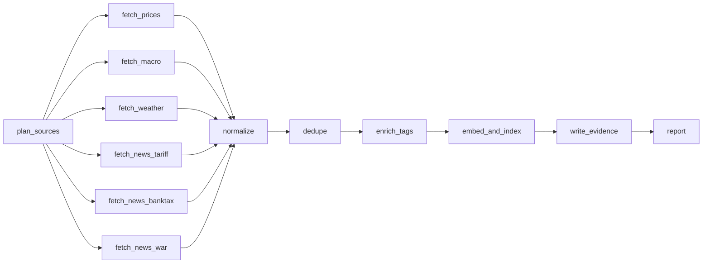

# Ingestion scaffold

The new package lives at `backend/src/fin_terminal`. The existing `stop_loss`
package and CLI remain available. Commands below run from the repository root
unless shown otherwise. Python 3.11+, uv, and GNU Make are the development tools.

```sh
make install
make test
make smoke
cd backend
uv run python -m fin_terminal.ingest --once
uv run python -m fin_terminal.ingest --once --fail-source weather
uv run python -m fin_terminal.ingest --once --fail-source macro --failure-mode rate_limited
uv run python -m fin_terminal.ingest --stream
uv run python -m fin_terminal.ingest --stream --max-cycles 2
```

If Make is unavailable, its targets are simply `cd backend` followed by
`uv sync`, `uv run pytest`, or `uv run python -m fin_terminal.ingest --once --smoke`.
Use Ctrl+C to stop continuous ingestion. Each cycle has a fresh run/thread ID;
streaming retains one result in memory. Checkpoints and evidence accumulate on disk.

Copy `.env.example` to `.env` and supply environment values as needed. Settings
read the current directory's `.env` and `../.env`, following the existing package.
Paths are relative to the working directory, so the Make targets write under
`backend/data`. Use absolute paths if launching from multiple working directories.

## Graph and contracts



The six fetch nodes run concurrently. A single join waits for all six before
normalization. Each source gets `ok`, `degraded`, `failed`, or `rate_limited`, with
fetch/normalization counts and timing. Expected provider errors and unexpected
exceptions are isolated inside fetch nodes. Cancellation propagates so shutdown
works. Failed normalization, embedding, or vector writes degrade the affected
stream and remain eligible for retry during later cycles.

All default connectors are explicitly empty stubs. `ok` means that the stub ran;
it does **not** claim that a live provider is healthy. No financial metrics are
generated, no embedding models are downloaded, and no vector requests are made
by an empty run. Override `STUB_FAIL_SOURCE` / `STUB_FAILURE_MODE`, or use the CLI
flags, to exercise failure handling.

Later providers implement `AsyncConnector.fetch`, `normalize`, and `health` and
are injected into `IngestionPipeline(connectors=...)`. The connector's `source`
identifies its rate-limit bucket; connectors sharing a provider quota should share
that ID. Graph state uses the six stream names; records retain a separate provider
field. The pipeline's source guards persist across streaming cycles. The TTL
cache is available to connectors but is not applied to the empty stubs.

`Document`, `PricePoint`, `MacroIndicator`, `WeatherEvent`, and `NewsArticle` are
Pydantic models. Timestamps are timezone-aware and canonicalized to UTC. Unknown
metrics stay null, absent primary metrics are flagged `missing_fields`, and
NaN/infinity are rejected. Theme values are uppercase. A news stream's query
theme is added as routing context; a weather measurement alone is not sufficient
evidence for a `WEATHER_EXTREME` tag.

## Persistence and timing

CLI execution uses `AsyncSqliteSaver`, the asynchronous SQLite checkpointer.
The same graph also accepts `SqliteSaver` with synchronous `graph.invoke`.
Both modes are tested. See the [SQLite saver reference](https://reference.langchain.com/python/langgraph.checkpoint.sqlite/SqliteSaver).
All checkpoint state is JSON-compatible, avoiding application object imports
during checkpoint restoration. Use the recorded ingest ID as `thread_id` when
inspecting a prior run with `get_state` / `aget_state`.

The relational document store uses SQLite WAL and a primary key on a canonical
SHA-256 content hash. Run IDs, fetch timestamps, processing telemetry, quality,
and enrichment tags are excluded from identity. A failed indexing attempt never
marks a record as complete. Successful vector writes use deterministic IDs, so a
retry after a crash between vector write and SQLite commit overwrites the same
vector. This is retry-safe idempotency, not a transaction across both databases.
Run only one ingestion process per local database/evidence path.

Vector stores hold projections (hash, source, provider, themes), linked to the
complete document and final timing in SQLite. Evidence is append-only UTF-8 JSONL,
flushed and synced after each entry. Every node emits start/completion entries,
fetch nodes record stream health, and indexing emits per-record timing and errors.
Local checkpoint, dedupe database, or evidence I/O failure stops the run rather
than claiming an unaudited success. Recovery from local disk failure is outside
this source-failure skeleton.

`fetch_latency_ms` includes fetch retries, rate limiting, and health checking.
Processing timing begins before source normalization and includes queue/barrier
delay, tagging, embedding, and indexing. Batch records conservatively share the
source normalization start time. `PROCESS_BUDGET_MS` is at most 1000; indexing
uses the remaining deadline and marks timeouts/overruns degraded. This scaffold
does not establish a production throughput or subsecond latency benchmark.
Local model warm-up, storage latency, and batch scheduling must be measured with
real connectors; synchronous work inside third-party code cannot be preempted.

## Tracing and smoke

Set `LANGSMITH_TRACING=true`, `LANGSMITH_API_KEY`, and `LANGSMITH_PROJECT` to enable
tracing. Each invocation has a root run name, all planned source/theme tags,
an ingest ID in metadata, and a unique trace ID propagated to records/evidence.
Graph nodes are traced by LangGraph; the report helper uses `@traceable`.
When no key is set (or tracing is disabled), a clear message explains why no
remote trace is emitted. Tests disable remote tracing and use mocks.

`make smoke` uses temporary databases and evidence files. It runs both the normal
graph and a graph with weather forced to fail. With tracing enabled it flushes
the client queue and reads back each completed root trace; a trace upload/read
failure fails smoke rather than printing a false success. No real LangSmith
delivery can be certified by an offline run. The implementation uses the SDK's
[flush API](https://reference.langchain.com/python/langsmith/client/Client/flush).

## Vector services and embeddings

`docker compose up -d weaviate` starts a localhost-only Weaviate service with a
persistent volume. It has no vectorizer because vectors are supplied by the
application. The adapter lazily creates `WEAVIATE_COLLECTION` and uses stable UUIDs.
Compose follows the [Weaviate Docker instructions](https://weaviate.io/developers/weaviate/installation/docker-compose).

For Pinecone, set `VECTOR_BACKEND=pinecone`, `PINECONE_API_KEY`, `PINECONE_HOST`
(the HTTPS data-plane URL), and `PINECONE_NAMESPACE`. Provision a vector index
with dimensions matching your chosen embedding model before using real records.
The scaffold never creates a billed cloud index. Adapter tests use `httpx`
mock transports; real service integration has not been exercised by smoke.

Install `uv sync --extra local-embeddings` for the default local model, or
`uv sync --extra openai-embeddings` for the OpenAI wrapper. Select using
`EMBEDDING_BACKEND`, with the relevant model/key environment variables. These
extras are lazy and not needed for stub tests. `--extra community` makes the
LangChain community tools and splitters available for later connectors.

Fixtures under `backend/tests/fixtures/` are explicitly labelled synthetic
contract fixtures. There are no live provider recordings yet because this
checkpoint implements no live data source; add sanitized recordings when wiring
each real connector. Never present the fixture article as market evidence.
